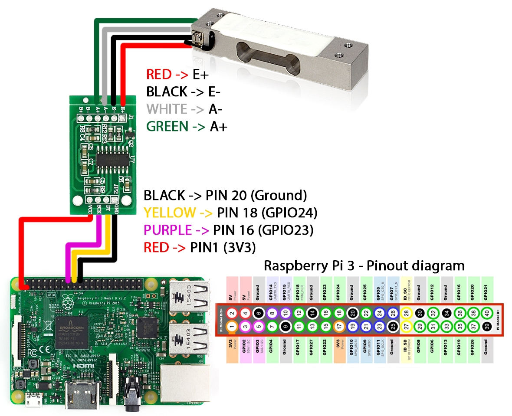

# Waging Module

## Used hardware:
 1. [Raspberry Pi 3](https://www.raspberrypi.org/products/raspberry-pi-3-model-b/)
 2. [hx711 module](https://learn.sparkfun.com/tutorials/load-cell-amplifier-hx711-breakout-hookup-guide)
 3. [Load Cell](http://en.wikipedia.org/wiki/Load_cell)
 4. [Logitech C920 HD Web Camera](http://www.logitech.com/en-us/product/hd-pro-webcam-c920)

## Usage:
### Connect the mechanical parts
Connect the Logitech C920 camera to the 3D printed body with one M6 screw.

Connect the 3D printed body with load cell using two M2 screws and four M2 washers. Load cell should point away from camera.

Connect the 3D printed bottle holder to the opposite side of the load cell load cell using two M2 screws and four M2 washers

Adjust the Logitech camera height so it looks onto the barcode you are trying to scan

### Connect the wires
Connect the the Load Cell to hx711 module and then to Raspberry PI 3 as shown on the picture bellow

### Connect the Logitech camera to one free USB port on Raspberry Pi

### Run the program on Raspberry Pi
Look into repository's [README](../README.md)

